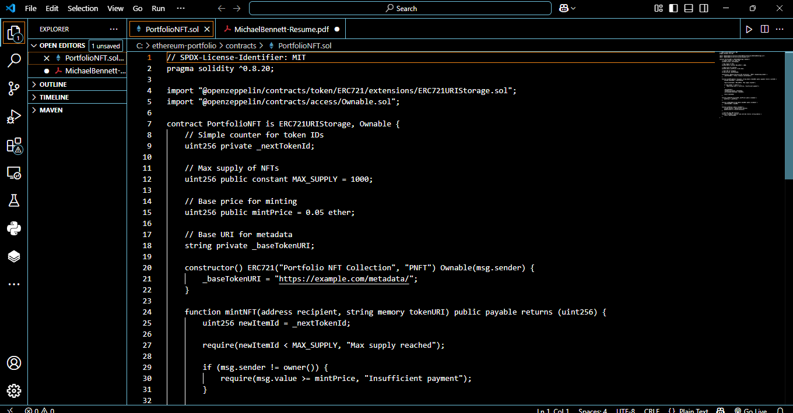
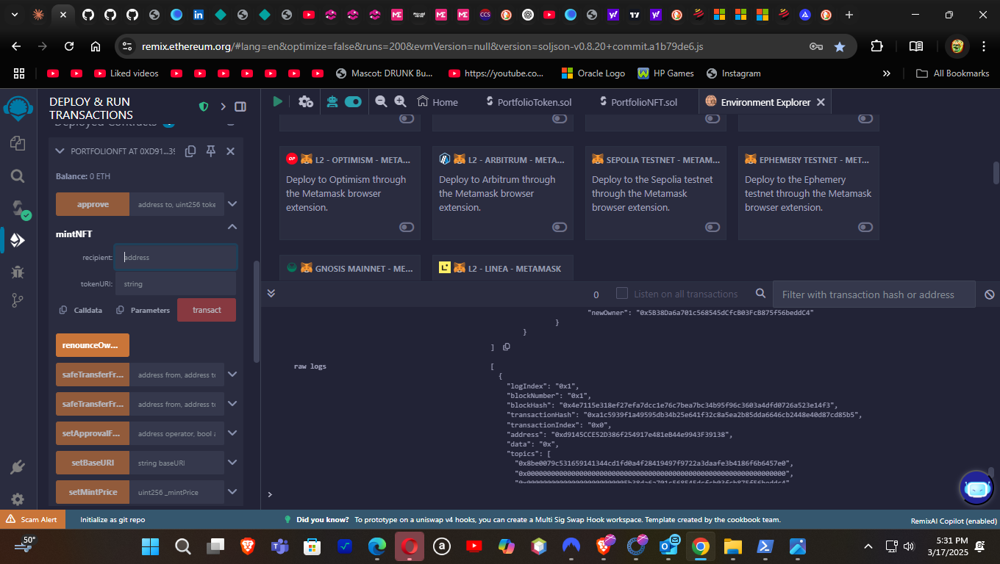

# Ethereum Smart Contracts Portfolio


A collection of Ethereum smart contracts showcasing token implementation, NFT creation, and DeFi mechanics. This repository demonstrates best practices in smart contract development, testing, and deployment.

## 📋 Project Overview

This portfolio includes:

- **ERC-20 Token Implementation** with staking functionality
- **ERC-721 NFT Collection** with customizable metadata
- **Comprehensive Testing Suite** demonstrating contract functionality
- **Deployment Scripts** for various networks
- **Development Environment Documentation**

## 📚 Smart Contracts

### PortfolioToken (ERC-20)

An ERC-20 token with additional functionality:

- Standard ERC-20 compliance
- Token minting (restricted to owner)
- Token burning
- Staking mechanism with time-based rewards
- Access control

```solidity
// Sample code snippet
function stake(uint256 amount) external {
    require(amount > 0, "Cannot stake 0 tokens");
    require(balanceOf(msg.sender) >= amount, "Insufficient balance");
    
    _transfer(msg.sender, address(this), amount);
    stakingBalance[msg.sender] += amount;
    stakingTimestamp[msg.sender] = block.timestamp;
    
    emit Staked(msg.sender, amount);
}
```

### PortfolioNFT (ERC-721)

A customizable NFT collection with:

- ERC-721 standard compliance
- Metadata URI storage
- Limited supply enforcement
- Configurable minting price
- Owner withdrawal function

```solidity
// Sample code snippet
function mintNFT(address recipient, string memory tokenURI) public payable returns (uint256) {
    require(msg.value >= mintPrice, "Insufficient payment");
    require(_tokenIds.current() < MAX_SUPPLY, "Max supply reached");
    
    _tokenIds.increment();
    uint256 newItemId = _tokenIds.current();
    _mint(recipient, newItemId);
    _setTokenURI(newItemId, tokenURI);
    
    return newItemId;
}
```

## 🖼️ Development Environment

Our development environment features both VS Code for efficient development and Remix IDE for rapid prototyping:

<table>
  <tr>
    <td></td>
    <td></td>
  </tr>
  <tr>
    <td>VS Code with Solidity extensions</td>
    <td>Remix IDE deployment interface</td>
  </tr>
</table>

For full details on the development environment, see [Development Environment Documentation](docs/development-environment.md).

## 🛠️ Technology Stack

- **Solidity**: Smart contract language (v0.8.20)
- **Hardhat**: Development environment
- **OpenZeppelin Contracts**: Secure, standard implementations
- **Ethers.js**: Ethereum interaction library
- **Waffle/Chai**: Testing framework
- **TypeScript/JavaScript**: Scripting languages

## 🚀 Getting Started

### Prerequisites

- Node.js (v14+)
- npm or yarn
- Git

### Installation

1. Clone the repository
   ```bash
   git clone https://github.com/mbennett-labs/ethereum-smart-contracts.git
   cd ethereum-smart-contracts
   ```

2. Install dependencies
   ```bash
   npm install
   ```

3. Compile contracts
   ```bash
   npx hardhat compile
   ```

4. Run tests
   ```bash
   npx hardhat test
   ```

## 🧪 Testing

The contracts include a comprehensive test suite to ensure functionality and security:

```bash
# Run all tests
npx hardhat test

# Run specific test file
npx hardhat test test/PortfolioNFT.test.js
```

## 📄 Documentation

This repository includes documentation of the full development workflow:

- [Development Environment Setup](docs/development-environment.md)
- [Contract Interaction Examples](docs/contract-interaction.md)

## 🔄 Deployment

Contracts can be deployed to various networks:

```bash
# Deploy to local hardhat network
npx hardhat run scripts/deploy.js

# Deploy to Sepolia testnet
npx hardhat run scripts/deploy.js --network sepolia
```

## 🔮 Future Development Plans

- Integration with frontend dApp (React)
- Additional DeFi mechanics including lending protocols
- Multi-chain deployment and interaction
- Gas optimization improvements

## 📜 License

This project is licensed under the MIT License - see the LICENSE file for details.