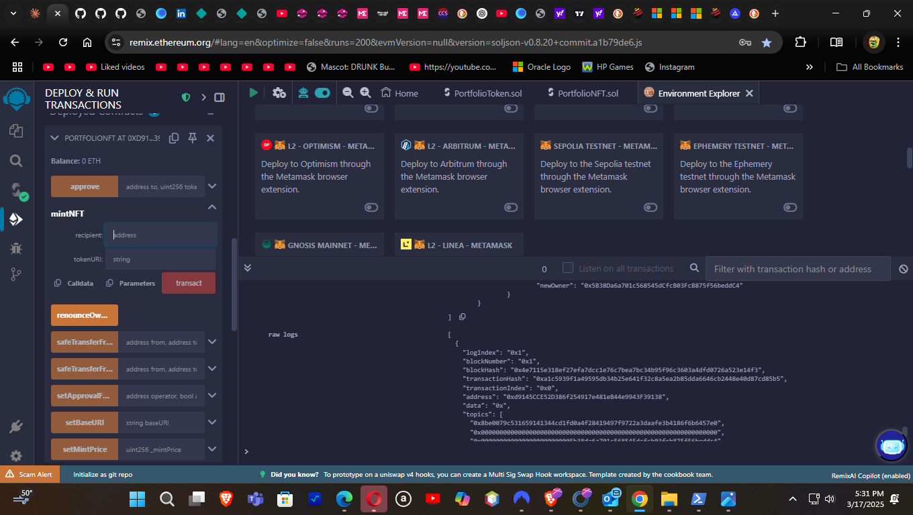
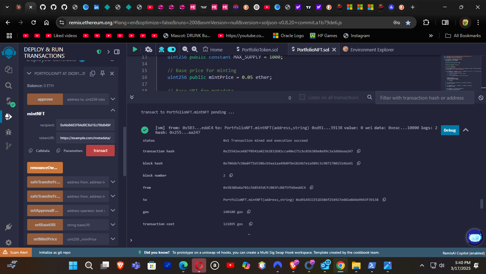

# Smart Contract Interaction Guide

This document demonstrates how to interact with the smart contracts in this repository using various tools and methods.

## Table of Contents
- [Prerequisites](#prerequisites)
- [PortfolioToken (ERC-20) Interactions](#interacting-with-portfoliotoken-erc-20)
  - [Using Hardhat Console](#using-hardhat-console)
  - [Using Ethers.js in a Frontend Application](#using-ethersjs-in-a-frontend-application)
  - [Token Staking Rewards](#token-staking-rewards)
- [PortfolioNFT (ERC-721) Interactions](#interacting-with-portfolionft-erc-721)
  - [NFT Minting Process](#nft-minting-process)
  - [Using Hardhat Console](#using-hardhat-console-1)
  - [Using Ethers.js in a Frontend Application](#using-ethersjs-in-a-frontend-application-1)
  - [NFT Metadata Schema](#nft-metadata-schema)
- [Remix IDE Interactions](#interacting-via-remix-ide)
- [Conclusion](#conclusion)

## Prerequisites

Before interacting with the smart contracts, ensure you have:

- Node.js and npm installed
- Hardhat development environment set up (`npm install --save-dev hardhat`)
- MetaMask or another Web3 wallet (for live network interactions)
- Project dependencies installed (`npm install`)

## Interacting with PortfolioToken (ERC-20)

The PortfolioToken is an ERC-20 compliant token with additional staking functionality.

### Using Hardhat Console

1. Start a local Hardhat node:
   ```bash
   npx hardhat node
   ```

2. Deploy the token contract:
   ```bash
   npx hardhat run scripts/deploy-token.js --network localhost
   ```

3. Connect to the console:
   ```bash
   npx hardhat console --network localhost
   ```

4. Interact with the deployed contract:
   ```javascript
   // Get the contract
   const PortfolioToken = await ethers.getContractFactory("PortfolioToken");
   const token = await PortfolioToken.attach("DEPLOYED_CONTRACT_ADDRESS");
   
   // Get token info
   const name = await token.name();
   const symbol = await token.symbol();
   const totalSupply = await token.totalSupply();
   console.log(`Token: ${name} (${symbol}), Total Supply: ${totalSupply.toString()}`);
   
   // Get account balances
   const [owner, addr1] = await ethers.getSigners();
   const ownerBalance = await token.balanceOf(owner.address);
   console.log(`Owner balance: ${ownerBalance.toString()}`);
   
   // Transfer tokens
   await token.transfer(addr1.address, 1000);
   const addr1Balance = await token.balanceOf(addr1.address);
   console.log(`Address 1 balance: ${addr1Balance.toString()}`);
   
   // Stake tokens
   await token.connect(addr1).stake(500);
   const stakedBalance = await token.stakedBalances(addr1.address);
   console.log(`Address 1 staked balance: ${stakedBalance.toString()}`);
   ```

### Using Ethers.js in a Frontend Application

```javascript
// Example using ethers.js
import { ethers } from "ethers";
import PortfolioToken from "./artifacts/contracts/PortfolioToken.sol/PortfolioToken.json";

async function connectToToken() {
  // Connect to provider (MetaMask)
  await window.ethereum.request({ method: 'eth_requestAccounts' });
  const provider = new ethers.providers.Web3Provider(window.ethereum);
  const signer = provider.getSigner();
  
  // Connect to contract
  const tokenAddress = "YOUR_DEPLOYED_CONTRACT_ADDRESS";
  const tokenContract = new ethers.Contract(
    tokenAddress,
    PortfolioToken.abi,
    signer
  );
  
  // Get token information
  const name = await tokenContract.name();
  const symbol = await tokenContract.symbol();
  const balance = await tokenContract.balanceOf(await signer.getAddress());
  
  console.log(`Token: ${name} (${symbol}), Balance: ${balance.toString()}`);
  
  // Transfer tokens
  const recipient = "RECIPIENT_ADDRESS";
  const amount = ethers.utils.parseUnits("1.0", 18); // 1 token with 18 decimals
  const tx = await tokenContract.transfer(recipient, amount);
  await tx.wait();
  console.log("Transfer complete!");
}
```

### Token Staking Rewards

The PortfolioToken contract implements a simplified staking mechanism where users earn rewards based on the duration of staking. The reward calculation uses a 5% APY model.

To use staking:

1. Call the `stake(uint256 amount)` function with the amount of tokens to stake
2. When ready to claim rewards, call the `unstake()` function
3. The contract will return your staked tokens plus any earned rewards

```javascript
// Staking example using ethers.js
async function stakeTokens() {
  const amount = ethers.utils.parseUnits("100", 18); // 100 tokens
  
  // Approve the contract to spend tokens (required before staking)
  await tokenContract.approve(tokenContract.address, amount);
  
  // Stake the tokens
  const stakeTx = await tokenContract.stake(amount);
  await stakeTx.wait();
  console.log("Tokens staked successfully!");
  
  // Later, unstake tokens and claim rewards
  const unstakeTx = await tokenContract.unstake();
  await unstakeTx.wait();
  console.log("Tokens unstaked with rewards!");
}
```

## Interacting with PortfolioNFT (ERC-721)

The PortfolioNFT is an ERC-721 compliant NFT contract with minting functionality.

### NFT Minting Process

The following steps illustrate how to mint an NFT using the PortfolioNFT contract:

1. **Deploy the Contract**
   - Select appropriate environment
   - Deploy with constructor parameters if needed

2. **Mint a New NFT**
   - Provide recipient address
   - Provide token URI (metadata location)
   - Execute the transaction
   
   

3. **Transaction Results**
   - The transaction emits Transfer and MetadataUpdate events
   - Token ID is returned from the function
   - Contract state is updated to reflect ownership

### Using Hardhat Console

1. Deploy the NFT contract:
   ```bash
   npx hardhat run scripts/deploy-nft.js --network localhost
   ```

2. Connect to the console:
   ```bash
   npx hardhat console --network localhost
   ```

3. Interact with the deployed contract:
   ```javascript
   // Get the contract
   const PortfolioNFT = await ethers.getContractFactory("PortfolioNFT");
   const nft = await PortfolioNFT.attach("DEPLOYED_CONTRACT_ADDRESS");
   
   // Get NFT info
   const name = await nft.name();
   const symbol = await nft.symbol();
   console.log(`NFT Collection: ${name} (${symbol})`);
   
   // Mint a new NFT
   const [owner, addr1] = await ethers.getSigners();
   await nft.mintNFT(
     owner.address, 
     "https://example.com/metadata/1"
   );
   console.log("NFT minted to owner");
   
   // Check owner's balance
   const ownerBalance = await nft.balanceOf(owner.address);
   console.log(`Owner NFT balance: ${ownerBalance.toString()}`);
   
   // Mint an NFT for another address (requires payment)
   const mintPrice = await nft.mintPrice();
   await nft.connect(addr1).mintNFT(
     addr1.address,
     "https://example.com/metadata/2",
     { value: mintPrice }
   );
   console.log("NFT minted to address 1");
   
   // Get token URI
   const tokenURI = await nft.tokenURI(1);
   console.log(`Token 1 URI: ${tokenURI}`);
   ```

### Using Ethers.js in a Frontend Application

```javascript
// Example using ethers.js
import { ethers } from "ethers";
import PortfolioNFT from "./artifacts/contracts/PortfolioNFT.sol/PortfolioNFT.json";

async function mintNFT() {
  // Connect to provider (MetaMask)
  await window.ethereum.request({ method: 'eth_requestAccounts' });
  const provider = new ethers.providers.Web3Provider(window.ethereum);
  const signer = provider.getSigner();
  
  // Connect to contract
  const nftAddress = "YOUR_DEPLOYED_CONTRACT_ADDRESS";
  const nftContract = new ethers.Contract(
    nftAddress,
    PortfolioNFT.abi,
    signer
  );
  
  // Get NFT information
  const name = await nftContract.name();
  const symbol = await nftContract.symbol();
  console.log(`NFT Collection: ${name} (${symbol})`);
  
  // Get mint price
  const mintPrice = await nftContract.mintPrice();
  console.log(`Mint price: ${ethers.utils.formatEther(mintPrice)} ETH`);
  
  // Mint a new NFT
  const userAddress = await signer.getAddress();
  const metadataURI = "https://example.com/metadata/user-nft";
  
  const tx = await nftContract.mintNFT(
    userAddress,
    metadataURI,
    { value: mintPrice }
  );
  
  await tx.wait();
  console.log("NFT minted successfully!");
  
  // Get user's NFT balance
  const balance = await nftContract.balanceOf(userAddress);
  console.log(`You now own ${balance.toString()} NFTs`);
}
```

### NFT Metadata Schema

When minting NFTs, you should follow this metadata schema:

```json
{
  "name": "Portfolio NFT #1",
  "description": "A unique NFT from the Portfolio Collection",
  "image": "https://example.com/images/1.png",
  "attributes": [
    {
      "trait_type": "Type",
      "value": "Example"
    },
    {
      "trait_type": "Level",
      "value": 5
    }
  ]
}
```

## Interacting via Remix IDE

You can also interact with your contracts using Remix IDE:

1. Open [Remix IDE](https://remix.ethereum.org/)
2. Create new files for each contract and paste in the source code
3. Compile the contracts using Solidity Compiler tab
4. Deploy using the Deploy & Run Transactions tab
   - Connect to a local development node or testnet using "Injected Provider - MetaMask"
   - Or use the JavaScript VM for quick testing
5. Interact with the deployed contracts using the auto-generated UI



After deploying, you'll see the contract functions available for interaction:



## Conclusion

These examples demonstrate basic interactions with the smart contracts in this repository. For advanced usage and integration with a complete dApp frontend, consider extending these examples with error handling, event listening, and user interface components.

For any questions or issues, please open an issue in the GitHub repository.
