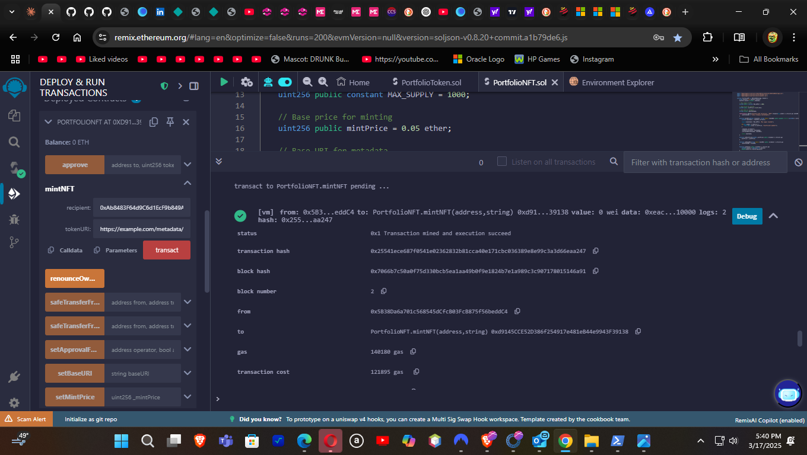

# Ethereum Development Environment

This document outlines the development environment and tools used for creating, testing, and deploying the smart contracts in this repository.

## Development Tools

### Primary IDE: Visual Studio Code

Visual Studio Code provides an excellent environment for Solidity development with the following extensions:
- **Solidity** by Juan Blanco - Provides syntax highlighting, compilation, and IntelliSense
- **Hardhat** - Integration with the Hardhat development framework
- **Prettier** - Code formatting
- **GitLens** - Enhanced Git capabilities

The screenshots below show our NFT contract open in VS Code with proper syntax highlighting and code organization:

#### Contract Structure and Variables

#### Contract Functions

VS Code provides a streamlined developer experience with features like:
- Syntax highlighting for Solidity code
- Code completion and suggestions
- Integrated terminal for running Hardhat commands
- Source control integration with Git

### Remix IDE

Remix is used for rapid prototyping and interactive testing:
- Browser-based IDE specifically designed for Ethereum
- Integrated debugger and testing environment
- Direct deployment to test networks
- VM environment for quick testing without deployment

#### Contract Compilation

The Remix IDE provides a powerful Solidity compiler with:
- Support for multiple compiler versions
- Detailed error reporting and warnings
- Optimization settings
- ABI generation

#### Contract Deployment & Interaction

After deployment, Remix provides an intuitive interface for:
- Calling contract functions
- Sending transactions with custom parameters
- Viewing transaction results and events
- Interacting with multiple contracts

#### Transaction Execution

The transaction execution view shows:
- Transaction status and details
- Gas usage and cost
- Block information
- Transaction hash and event logs
- Debug options for troubleshooting

The diagram below illustrates the NFT minting process using Remix:

## Framework and Libraries

### Hardhat Development Environment

This project uses Hardhat for compilation, testing, and deployment:
- TypeScript/JavaScript-based development environment
- Local Ethereum network for development
- Advanced debugging features
- Task automation

### OpenZeppelin Contracts

The smart contracts extend the battle-tested OpenZeppelin implementations:
- ERC20 and ERC721 base implementations
- Access control mechanisms
- Utilities and security components

## Development Workflow

### Local Development
1. Write contract code in VS Code
2. Compile using Hardhat: `npx hardhat compile`
3. Run local tests: `npx hardhat test`

### Interactive Testing
1. Deploy to Hardhat Network: `npx hardhat node`
2. Deploy contracts: `npx hardhat run scripts/deploy.js --network localhost`
3. Interact via console: `npx hardhat console --network localhost`

### Testnet Deployment
1. Deploy to Sepolia: `npx hardhat run scripts/deploy.js --network sepolia`
2. Verify contract on Etherscan: `npx hardhat verify --network sepolia <CONTRACT_ADDRESS>`

## Network Connections

The project is configured for deployment to multiple networks:
- Local Hardhat Network for development
- Sepolia Testnet for testing
- Optimism, Arbitrum, and other Layer 2 networks for scaling solutions